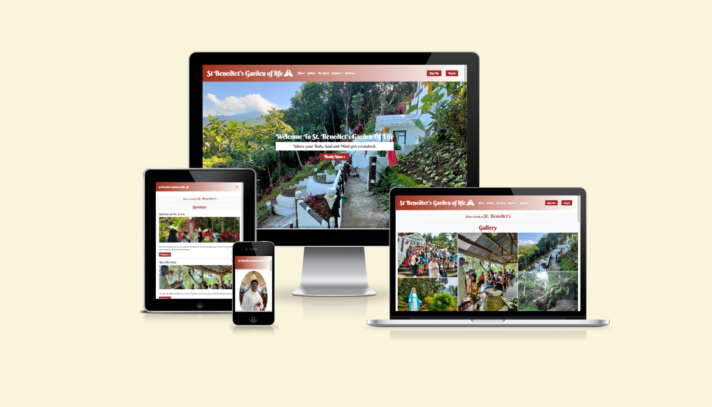

# St Benedict's Garden of life
This is a promise website to be for my uncle Fr. Vicente 'Inting' Mandaya who devevelop and founded St Benedict's Garden of life.
Most of the features in this site are already in place except that the services being offered is still and imagination awaiting for a final decision on how to market
St Benedict's to customers.

St Bendict's has been open to the public for a quite sometime now servicing variety of religious activities that you can see in the gallery, like Station of the Cross, Retreats, Recollection, Sto. Nino celebration and many more..

St Benedict's Garden of Life is a fully responsive website that allow users to book, update and delete a reservation. Only sign-up users are allowed to create a booking,
otherwise the user can have a looked only at the St Benedict's Garden of life website.

# Navigation
 * The navigation bar is featured in  seven pages.
 * When the user is not logged in the Sign Up and Log in button displays but when a user is logged in this disappears and replaced with Reservations and Log Out buttons including the username of the user and a welcome to St Benedict! message. A successfully signed message also displays in the reservations page.
 * The Contact and Services uses dropdown to access the page.
 * The buttons are using a color combination of brown #FFFFFF with a hover effect.
 * It uses linear-gradient(to right, rgb(160, 48, 26), #FFFFFF) background color.
 * The hand praying icon is taken from font awesome.

 

 

 

 # Landing Page
  * The landing page image is the side view structure of the St Benedict's Garden main attraction in the hills of Sitio Migsale.
  * It has a welcome messaage overlay and book now link to bring the user to the Log in page. The user will be ask to sign up first if the users have not created an account yet.
    Once the user is signed in, the user will be redirected back to the home page. The user can then click the book now button and brings the user to the booking form page. The user can also access the booking form page through the Reservations button and then click the make a booking here button.

  
 
 

 * This is how the homepage looks in a mobile device.

 

