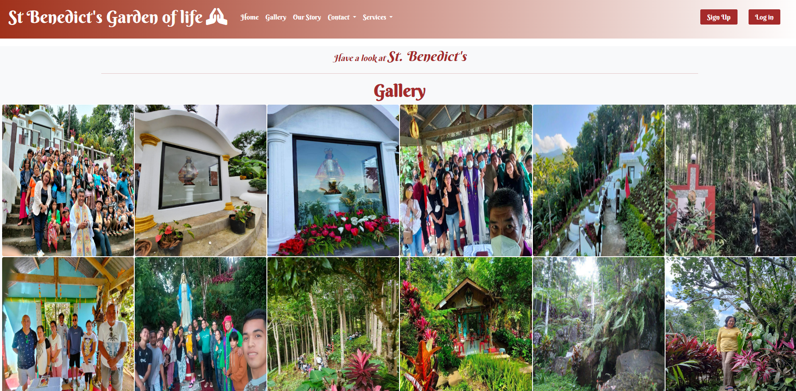
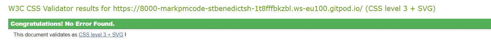

# St Benedict's Garden of life
This is a promise website to be for my uncle Fr. Vicente 'Inting' Mandaya who devevelop and founded St Benedict's Garden of life.
Most of the features in this site are already in place except that the services being offered is still an imagination awaiting for a final decision on how to market
St Benedict's to customers.

St Bendict's has been open to the public for a quite sometime now servicing variety of religious activities that you can see in the gallery, like Station of the Cross, Retreats, Recollection, Sto. Nino celebration and many more..

St Benedict's Garden of Life is a fully responsive website that allow users to book, update and delete a reservation. Only sign-up users are allowed to create a booking,
otherwise the user can have a looked only at the St Benedict's Garden of life website.

# Navigation
 * The navigation bar is featured in  seven pages.
 * When the user is not logged in, the Sign Up and Log in button displays but when a user is logged in this disappears and replaced with Reservations and Log Out buttons including the username of the user and a welcome to St Benedict! message. A successfully signed message also displays in the reservations page.
 * The Contact and Services uses dropdown to access the page.
 * The buttons are using a color combination of brown #FFFFFF with a hover effect.
 * It uses linear-gradient(to right, rgb(160, 48, 26), #FFFFFF) background color.
 * The hand praying icon is taken from font awesome.

 

 

 

 # Landing Page
  * The landing page image is the side view structure of the St Benedict's Garden main attraction in the hills of Sitio Migsale.
  * It has a welcome message overlay and book now link to bring the user to the Log in page. The user will be ask to sign up first if the users have not created an account yet.
    Once the user is signed in, the user will be redirected back to the home page. The user can then click the book now button and brings the user to the booking form page. The user can also access the booking form page through the Reservations button and then click the make a booking here button.

  
 
 

 * This is how the homepage looks in a mobile device.

 

# Gallery
 * In this page the user can take a look of the images taken from St Benedict'Garden of Life.
 * It has a transition and animation effects and it also transforms when hovered to scale(1.2)
 * It has a column count of 6 in a desktop view, column count of 3 in screen size max-width of 1024 px, column count of 2 in in screen size max-width of 715px and column count of 1 when it has a max-width of 414px. 

 

 

# Our Story Page
 * Here the user can read a little bit of story on how St Benedict's Garden of Life had all started.
 * The image of a Priest is Fr Inting himself and the content of the story was provided by him.
 * The second image was the very first structure built in the St. Benedict's garden of Life. 

 

 
 

# Contact Page
 * In this page the location and Contact us are displayed alongside in a desktop view using an inline display.
 * In a mobile device, the view is a block display

 

 

# Services 
 * The services being offered on this site is an imagination but can be use in the near future..
 * A book now button below the images will bring the user to the booking form page.
 * Images are all taken on site during previous activities in St Benedict's Garden of Life.

 

 

# Agile methodology
The Agile Methodolgy was not implemnented in the first submission of this project.

Here is my implementation of Agile methodology to create User Stories using a template in Github
* In the st_benedict_shrine repository
* Click the settings tab and scroll down to issues section
* Click the "Set up templates" button
* On the dropdown selection, click Custom template
* To make the file become part of the code repository, click "Propose changes" button
* Add a commit message and then click the "Commit Changes" button
* You can now use this template to create new user stories
* To view the Acceptance Criteria and Task , click [here](https://github.com/Markpm-code/st_benedict_shrine/issues) and then click each link of the user story

## Creating a Kanban Board
* In the st_benedict_shrine repository , click the "Projects" tab
* In the dropdown menu, click "New project"
* Click the "New project" button to open a template selection
* Select "Board" and customize the project name
* Click the "Create" button
* A new tab opens where you can track, moved and edit the status of the user stories
* In the "Add item section" can also be used to add a user story and convert it into issues

## Manual Testing
### Navigation - user is not logged in

| Feature  | Action | Expected Result |
| ------------- | ------------- | ------------- |
| "Home" Link   | Clicking the "Home Link" while the user is the different pages of the site  | The user is redirected back to the hompage  |
| St Benedict's Garden of Life as "Home Link"  | Clicking the "St Benedict's Garden of Life" while the user is the different pages of the site  | The user is redirected back to the hompage  |
| "Gallery Link" | Clicking the "Gallery" in the navbar | User is directed to the Gallery page |
| "Our Story" Link | Clicking the "Our Story" in the navbar | User is directed to the Our Story page | 
| "Contact" Dropdown Menu | Click Contact dropdown menu | User have two options to click, the location and Contact Us. When clicked, the user is directed to both pages |
| "Services" Dropdown Menu | Click Services dropdown menu | User have two options to click, the Station of the Cross and recollection. When clicked, the user is directed to both pages |
| "Sign Up" Link | Click Sign Up | The user is directed to the Sign Up form page |
| "Log in" Link | Click Log in | The user is directed to the Log in form page |

### Navigation - user is logged in

| Feature  | Action | Expected Result |
| ------------- | ------------- | ------------- |
| "Reservations" Link | Click Reservations | The user is directed to the "Reservations" page |
| "Log Out" Link | Click Log out | The user is directed  to the "Log out" page |

### Home & Contact Pages

| Feature  | Action | Expected Result |
| ------------- | ------------- | ------------- |
| "Book Now" button link | Click Book Now | The user is directed to the Log in page if not logged in. If Logged in, the user is directed to the Booking form page |
| "Location" Contact dropdown menu | Click Location | The user is directed to the location page |
|  "Contact Us" Contact dropdown menu | Click Contact Us | the user is directed to the Contact us page |
| "Maps Directions" Link | Click Directions | The user is directed to a google maps tab to start getting the directions but in mobile device, the directions link display is hidden and only left with a "View larger map" link which may lead to unexpected result |
| Navigation Controls and Functionality | Test Navigation Controls and Functionality | All Controls and Functionality are working |
| "St. Benedict's Garden of life facebook page" link | Click the link | The user is directed to new tab of "St. Benedict's Garden of life facebook page" |

### Gallery Page

| Feature  | Action | Expected Result |
| ------------- | ------------- | ------------- |
| "Gallery" link | Click Gallery | The images fades in effect is working |
| "Images" | Hover images | The images scales to 1.2  when it is hovered |
| "Responsiveness" | Test responsiveness of images | Images are responsive to smaller devices |

### Our Story Page

| Feature  | Action | Expected Result |
| ------------- | ------------- | ------------- |
| "Our Story " Link | Click Our Story | The user is directed to Our Story Page |
| "Content & Images | Inspect story content and images | The story content and 2 images are present |

### Services Page

| Feature  | Action | Expected Result |
| ------------- | ------------- | ------------- |
| "Station of the cross" Link | Click Station of the cross | The user is directed to the Station of the Cross page |
| "Book Now" button of the Station of the Cross Page | Click Book Now | The user is directed to the Log in page if not logged in. If Logged in, the user is directed to the Booking form page |
| "Book Now" button of the Recollection Page | Click Book Now | The user is directed to the Log in page if not logged in. If Logged in, the user is directed to the Booking form page |

### Sign Up

| Feature  | Action | Expected Result |
| ------------- | ------------- | ------------- |
| "Sign Up" Link | Click Sign Up | The user is directed to the sign up form page |
| "Email" input field | Test for required fileds | validations, error handling and usability are managed by Django allauth |
| "Password and Password (again)" | Test for required fields | validations, error handling and usability are managed by Django allauth |
| "Sign Up" button | Click Sign Up | Once all required fields are satisfied, the user will be redirected to the homepage, the username will be displayed along with the navbar items with a Hello " Username" Welcome to St. Benedict! indicating that they are logged in. The sign up and log in buttons will be replace with reservations and Log Out buttons |

# Testing
## HTML Validation
 * Used [W3C](https://validator.w3.org/) to validate HTML
 * Validated by URL directly from gitpod

 

## CSS Validation
 * Used [W3C-Jigsaw](https://jigsaw.w3.org/css-validator/) to validate CSS.
 * Validated by URL directly from gitpod

 

## PYTHON Validation
  * Used [CI Python Linter](https://pep8ci.herokuapp.com/) to validate Python codes.
  * There are several errors such as:
    * Whitespace in Models.py
    * Line too long, blank line contains white space, and no newline at the end of file in validators.py
    * Line too long, trailing whitespace, and blankline contains white space in forms.py
    * Below screenshot is the Settings.py errors

   

  * All errors are resolved, all clear and no errors found  after running it in Code Institute [CI Python Linter](https://pep8ci.herokuapp.com/)

## Lighthouse 
 * Home Page Desktop Testing / Tested in incognito mode
   * Desktop 

  

 * Home Page Mobile Testing / Tested in incognito mode
   * Mobile

 

 * Gallery Page Desktop Testing / Tested in incognito mode
   * Desktop
   * Gallery is the only page of the site that scores low in Performance, the rest of the pages scores high.

 
 

## Responsiveness
 * Used this site [Am I Responsive](https://ui.dev/amiresponsive) to check the St. Benedict's Garden of Life responsiveness

 

# Deployment
## Setting up basic Django Project and Deploying to Heroku
 * You can find the instructions [here](https://docs.google.com/document/d/1P5CWvS5cYalkQOLeQiijpSViDPogtKM7ZGyqK-yehhQ/edit), a cheat sheet created by [Code Institute](https://codeinstitute.net/ie/)

## Heroku Deployment 
 * After following the instructions above
   * Add another Config Var in Heroku's Settings, The key is PORT and the value is 8000
   * Click Deploy tab in Heroku
   * In the 'Deployment method' section select 'Github' and click the 'connect to Github' button to confirm.
   * In the 'search' box enter the Github repository name for the project
   * Click search and then click connect to link the heroku app with the Github repository. The box will confirm that heroku is connected to the repository.

## Final Deployment
 * In the (IDE) Integrated Development Environment:
  * When development is complete change the debug setting to: DEBUG = False in settings.py   
  * In Heroku settings config vars delete the DISABLE_COLLECTSTATIC
  * In Heroku click the 'Deploy Branch' branch button. When deployment is successful, a message 'Your app is deployed to heroku. Click open app button and the The install worked successfully! Congratulations! messages will be displayed.

## Cloning the Repository
 * How to Clone the Repository
   * Copy this link https://github.com/Markpm-code/st_benedict_shrine
   * In your IDE terminal, type git clone and paste the copied URL
   * Then press enter

## Forking the Repository   
 * How to Fork the Repository
  * Navigate to https://github.com/Markpm-code/st_benedict_shrine
  * In the right side of the page under the "About" section.
  * Click the fork or fork icon to create a copy of the original repository into your Github Account.
